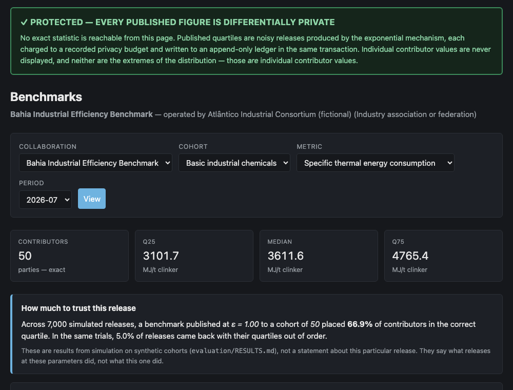
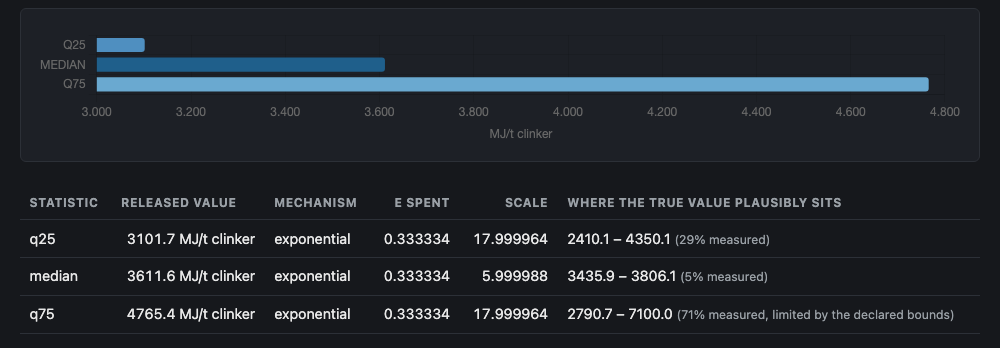
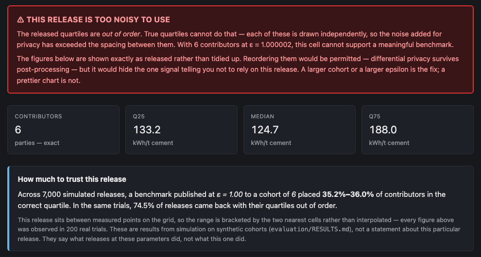
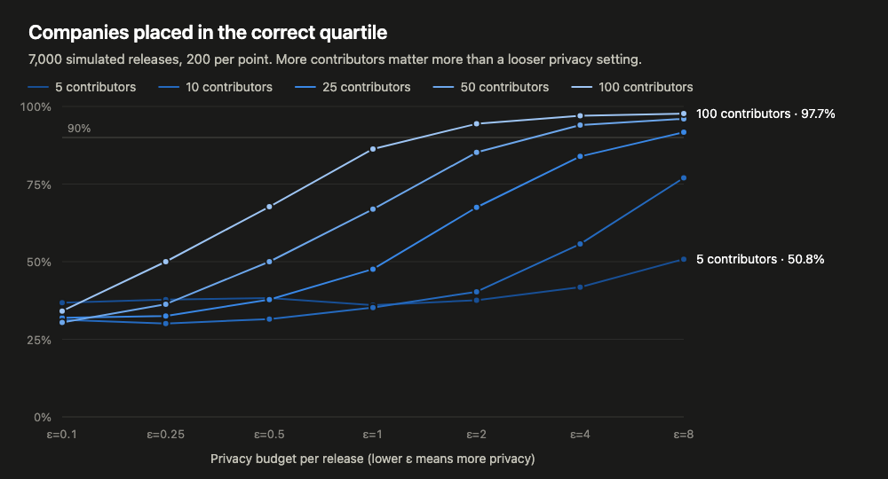
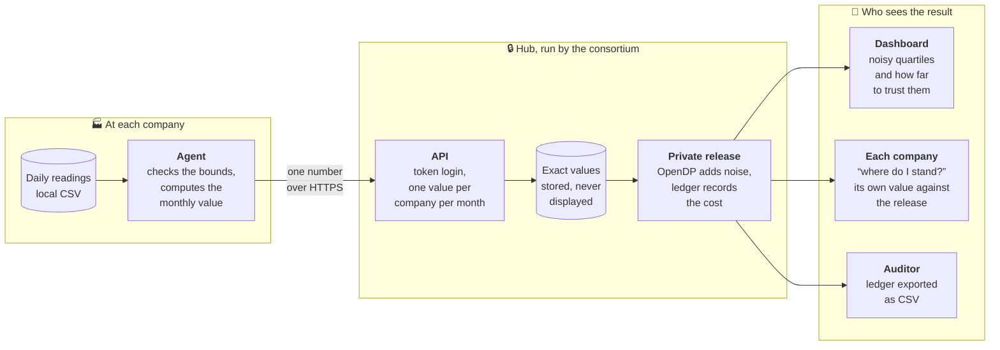
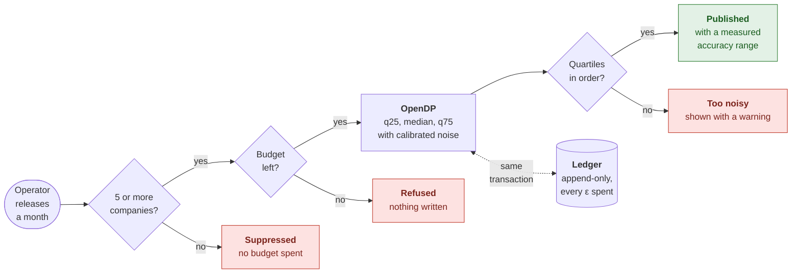

# Bússola

Benchmarking for companies that can't share their data with each other.

[](https://github.com/jorgel-mendes/bussola/actions/workflows/ci.yml)

**[Live demo](https://bussola-hub.onrender.com)** · [How it works](#how-it-works) · [Design doc](docs/DESIGN.md) · [Results](evaluation/RESULTS.md) · [Task board](https://trello.com/b/ZMEqk4Up/bussola-msse-capstone)



Companies in the same sector all want to know how they compare, but finding out
usually means handing your data to someone else. Bússola lets a group of
companies build shared benchmarks without anyone seeing anyone else's numbers.
It also tells you how far to trust each result, which is something most tools
in this space leave out.

I built it as my capstone project for the Master of Science in Software
Engineering at Quantic.

---

## Why I built it

In my chemical engineering degree, almost every question worth researching
needed real plant data, and we rarely got it. Companies weren't hostile. There
just wasn't a safe way for them to say yes, so the answer was usually no.

The same problem shows up well outside universities. Hospitals can't easily pool
results across sites, and statistical agencies have to publish without exposing
the people they surveyed.

Today that trust usually rests on a contract: a confidentiality agreement and a
promise. Under privacy laws like Brazil's LGPD, a promise isn't something a
compliance officer can sign off on.

Bússola replaces the promise with something you can check:

1. Each company computes its own numbers on its own machine and sends only a
   summary.
2. The hub publishes group statistics protected by
   [differential privacy](https://en.wikipedia.org/wiki/Differential_privacy).
3. Every bit of privacy spent is recorded in a ledger that can't be edited, so
   an auditor can verify it later.

### Who it's for

The operator is whoever the members already trust, like an industry
association, a university data office or a statistical agency. They have the
members and the mandate. Bússola gives them the mechanism.

Large players already have options. Catena-X connects the German automotive
supply chain, MELLODDY let ten rival pharma companies train models together, and
AWS, Snowflake and Decentriq all sell "data clean rooms". Those are built for
enterprises with legal teams and big budgets (MELLODDY spent $1.19M on compute
in a single year). Research groups and regional consortia have the same problem
with far fewer options.

I chose an industrial example (cement plants, and the thermal energy they use
per tonne of clinker) because of my own background, and because physical limits
made the metric's bounds easy to justify and test. The sources are in
[docs/REFERENCES.md](docs/REFERENCES.md).

---

## What it does

### Publishes benchmarks you can't reverse-engineer

The dashboard never shows an individual company's value. Quartiles are released
through OpenDP's exponential mechanism, and each release is paid for from a
privacy budget. If a release would go over budget, the system refuses it.



Beside each number is a range for where the true value probably sits. OpenDP
doesn't provide that for this mechanism, so I measured it by simulation (more on
that [below](#what-i-learned-from-testing-it)).

### Says when a result isn't good enough



With only six contributors, the privacy noise is bigger than the gaps between the
quartiles, so they can come out in the wrong order. Here the median landed below
the first quartile.

Sorting them would be allowed, but it would also hide the clearest sign that
this result can't be trusted. So the dashboard shows the numbers as they came out
and flags the release.

### Answers "where do I stand?"

This is the question a company joins to get answered. It runs on the company's
own machine with its own credentials:

```bash
uv run bussola-agent position --metric specific_thermal_energy --period 2026-07
```

```
your value  : 3664.849613 MJ/t clinker
benchmark   : q25=3182.211055  median=3262.713568  q75=3772.562814
              from 47 contributors, ε=1.000002

You are in Q3.
```

It doesn't use any privacy budget, because it only compares your own number with
a result that was already published. If that result was flagged as too noisy,
the command says so instead of guessing.

### Lets an auditor check the budget

```bash
uv run python hub/manage.py export_ledger --collaboration bahia-industry --period 2026-07
```

This exports every privacy spend in order, with a running total next to the
approved budget, so you can see at a glance whether the budget was ever
exceeded.

---

## What I learned from testing it

I ran 7,000 simulated releases through the system and compared each one with the
true values, which I knew because the data is synthetic.



A few things stood out:

- **Group size matters more than the privacy setting.** Placing 90% of companies
  in the right quartile took ε=2 with 100 contributors, ε=4 with 50, or ε=8 with
  25. Each pair multiplies to about 200, so halving the privacy cost means
  doubling the group.
- **Small groups don't get rescued by a looser setting.** With 5 contributors,
  going from ε=0.1 to ε=8 only raised correct placement from 37% to 51%.
- **The demo is realistic, not flattering.** It uses ε=1, a common value in the
  research literature. With 50 contributors that places 66.9% of companies
  correctly, and the dashboard shows that figure next to the benchmark. I could
  have picked a setting that looked better, but I'd rather show where the system
  stands today.

The full write-up, including the method and its limits, is in
[evaluation/RESULTS.md](evaluation/RESULTS.md).

---

## How it works

### Where the data goes

Each company's raw readings stay on its own machine. Only one number per month
crosses the network, and nobody outside the hub ever sees that number unaltered.



### What happens when a month is released

Publishing is a decision the operator makes, and the hub checks three things
before anything reaches a reader. Every check can say no.



Checking your own position spends no budget: it compares a company's own
submitted value with a release that has already been published and paid for.

### The pieces

The **agent** is a small command-line tool that runs at each company. It reads a
local CSV file, computes a summary and sends only that. It's a separate package
with no Django dependency, so each company runs its own program with its own
credentials.

The **hub** stores submissions, releases differentially private statistics,
keeps the privacy ledger and serves the dashboard.

**Built with:** Python 3.12, Django 5, Django REST Framework, OpenDP, Polars,
PostgreSQL, pydantic, Typer, Chart.js, Docker, GitHub Actions and Render.

| Folder | What's in it |
|---|---|
| `hub/` | The Django app: ingestion API, privacy mechanisms, budget ledger, dashboard, admin |
| `agent/` | The command-line tool each company runs |
| `contracts/` | The data format shared by the agent and the hub |
| `datagen/` | Synthetic plant data, with the true values saved for testing |
| `evaluation/` | The simulation behind the results above |

<details>
<summary>Agent exit codes</summary>

The agent is meant to run unattended (from cron, for example), so its exit codes
tell you what to do next.

| Code | Meaning | What to do |
|---|---|---|
| 0 | Submitted | Nothing |
| 1 | Configuration or local data problem | Someone needs to look at it |
| 2 | The hub rejected the data | Don't retry without changing it |
| 3 | Temporary problem (network, server error) | Retry later |

</details>

---

## Run it locally

You'll need [uv](https://docs.astral.sh/uv/) and Python 3.12.

```bash
uv sync
uv run python hub/manage.py migrate
uv run python hub/manage.py seed_demo --contributors 12 --periods 24 --tokens-out data/tokens.json
uv run python datagen/generate.py --contributors 12 --periods 24 --out data
uv run python hub/manage.py runserver
```

The dashboard is at <http://127.0.0.1:8000/> and the admin is at `/admin/` (run
`createsuperuser` first).

**Submit data as a company.** `--dry-run` shows exactly what would be sent
without sending it:

```bash
export BUSSOLA_HUB_URL=http://127.0.0.1:8000
export BUSSOLA_TOKEN=$(python3 -c "import json;print(json.load(open('data/tokens.json'))['plant-01'])")
uv run bussola-agent submit --metric specific_thermal_energy --period 2026-07 \
  --file data/plant-01/specific_thermal_energy.csv --dry-run
```

**Publish a release.** Check the cost first, since spent privacy budget can't be
refunded. Remove `--dry-run` to publish:

```bash
uv run python hub/manage.py release_period --collaboration bahia-industry --period 2026-07 --epsilon 1.0 --dry-run
```

<details>
<summary>Multi-party demo with Docker</summary>

Three agents in separate containers, each with its own volume and token,
submitting to the hub over the network:

```bash
docker compose up --build hub
docker compose run --rm seed
docker compose up agent-01 agent-02 agent-03
```

</details>

---

## Tests

```bash
uv run pytest
uv run pytest --cov --cov-report=term-missing
uv run ruff check .
```

There are 412 tests with 93% coverage, and CI runs them on every push. Many of
them protect privacy rules rather than ordinary behaviour. For example, one makes
sure a company that submits twice isn't counted twice.

CI uses PostgreSQL instead of SQLite, because the budget's locking only works
on a real database. A guard test fails the build if the concurrency tests are
skipped. For the most important tests, I deliberately broke the code they
protect to confirm they actually fail.

The 7,000-release simulation takes about two and a half hours, so it runs in a
separate workflow instead of on every push.

---

## Project documents

This started as a three-sprint capstone, and the process is documented along
with the code.

| Document | What it covers |
|---|---|
| [Design & testing](docs/DESIGN.md) | Architecture, patterns, deployment options and costs, test strategy |
| [Architecture decisions](docs/adr/) | Why Django, why central differential privacy, why OpenDP, how tenancy works |
| [Results](evaluation/RESULTS.md) | The privacy vs. accuracy simulation |
| Sprint reviews | [Sprint 1](docs/SPRINT-1-REVIEW.md) · [Sprint 2](docs/SPRINT-2-REVIEW.md) · [Sprint 3](docs/SPRINT-3-REVIEW.md) |
| [Task board](https://trello.com/b/ZMEqk4Up/bussola-msse-capstone) | Every user story and task, on Trello |
| [Future backlog](docs/FUTURE-BACKLOG.md) | Where the project could go next |

## What's next

The simulation showed that Bússola works best for larger groups, so most of the
ideas for what comes next focus on smaller ones. They include protecting
individual records rather than whole companies (which would let a single company
benchmark its own plants), secure aggregation for groups of two to ten, and a
tighter privacy accountant that gets more out of the same budget. Details are in
the [future backlog](docs/FUTURE-BACKLOG.md).

---

Made by **Jorge Luis dos Santos Mendes**, a chemical engineer and data engineer
based in Salvador, Brazil.
[LinkedIn](https://www.linkedin.com/in/jorgelsmendes/) · [GitHub](https://github.com/jorgel-mendes)
